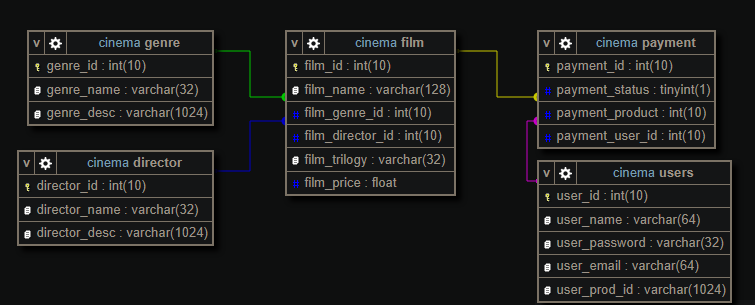

# DB Structure

# Algorythms-effectiveness-research
Research on the effectiveness of sorting methods: Insertion, Shell on multidimensional arrays

### Steps:
#### 1. Compile project with gcc
#### 2. Enter three-dimentional array size
#### 3. Choose one of the following modes:
  Individual sorting to get results for one algorythm
  Packet sortng to get results for all algorythms
